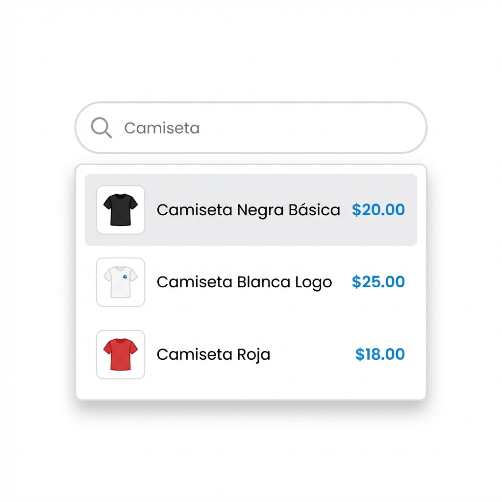
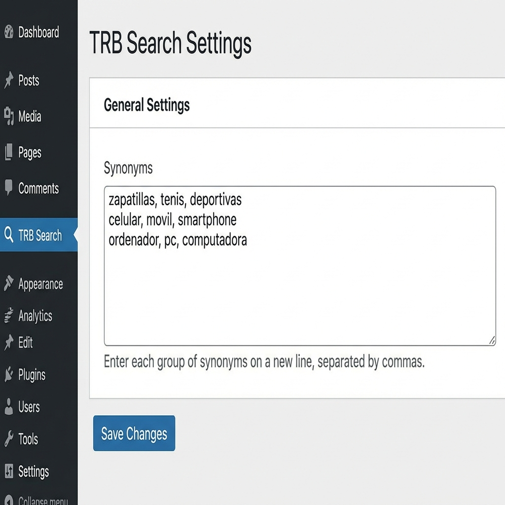
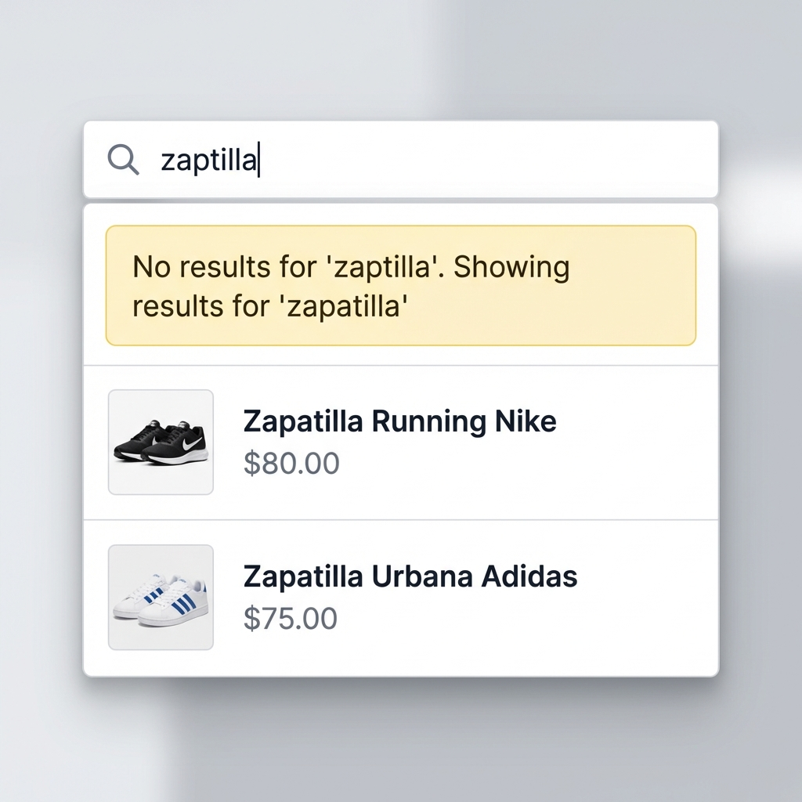

# TRB Product Search

A lightweight, efficient, and user-friendly product search plugin for WooCommerce. enhancing the default search experience with AJAX results, synonyms support, and intelligent typo correction.

## Features

*   **Real-time AJAX Search**: Instant dropdown results as you type.
*   **SKU Search**: Enable search by product SKU with priority ranking for exact matches.
*   **Attributes Search**: Search through product attributes like color, size, brand, and more.
*   **Synonyms Support**: Map synonymous terms (e.g., "cellphone" -> "smartphone") so customers always find what they need.
*   **Typo Correction**: Automatically suggests corrections for misspelled words (e.g., "samsng" -> "Samsung").
*   **Performance**: Optimized for speed, compatible with large catalogs.
*   **Minimalist Design**: Clean UI that fits any theme.

## Screenshots

### Instant Search Dropdown
Fast results with thumbnails and prices directly in the search bar.


### Synonyms Configuration
Easily manage synonymous terms in the admin panel.


### Intelligent Typo Correction
Helps users find products even when they make spelling mistakes.


## Installation

1.  Upload the plugin files to the `/wp-content/plugins/trb-product-search` directory, or install the plugin through the WordPress plugins screen.
2.  Activate the plugin through the 'Plugins' screen in WordPress.
3.  Ensure WooCommerce is installed and active.
4.  Go to **Settings > TRB Search** to configure synonyms.

## Configuration

### SKU Search
Enable or disable search by product SKU. When enabled, customers can search for products using their SKU codes. Exact SKU matches are prioritized in results.

Navigate to **Settings > TRB Search** and check the "Search by SKU" option to enable this feature.

### Attributes Search
Enable search through product attributes such as color, size, material, brand, and more.

1. Navigate to **Settings > TRB Search**
2. Check the "Search by Attributes" option
3. Select which attributes to include in the search (e.g., Color, Size, Brand)

When a customer searches for a term like "red" or "large", products with matching attribute values will appear in the results.

### Synonyms
To add synonyms, navigate to **Settings > TRB Search**. Enter groups of synonyms, one group per line, separated by commas.

Example:
```
sneakers, trainers, running shoes
tv, television, telly
cellphone, mobile, smartphone
```

### Typo Correction
The typo correction index is built automatically when you save products. To ensure it's up to date, simply update a product in your store. The index now includes product titles, SKUs, and attribute terms.

## Requirements
*   WordPress 5.0+
*   WooCommerce 3.0+
*   PHP 7.4+
