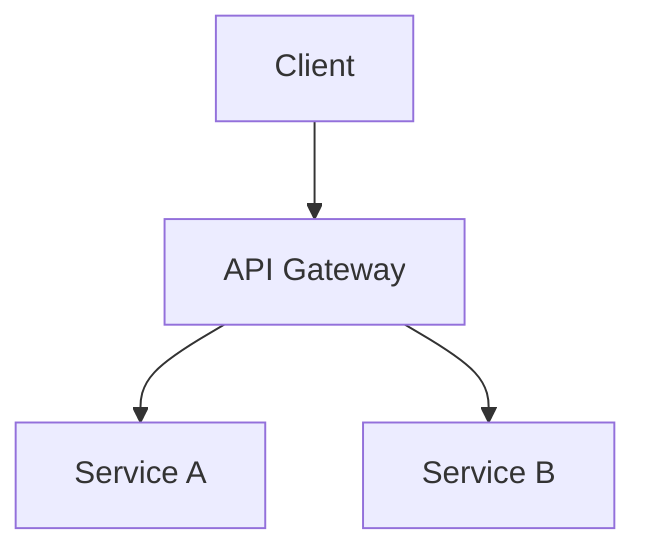

# Technical Plan Template

Use this structure to organize technical plans. Adapt sections as needed for the specific project type (e.g., CLI vs. Web App vs. Library).

## 1. Executive Summary
*Briefly describe the goal, the "what" and "why" of the project.*

## 2. Requirements Analysis

### 2.1 Functional Requirements
*What must the system do?*
- [ ] User can...
- [ ] System must...

### 2.2 Non-Functional Requirements
*Performance, security, reliability, etc.*
- Performance: (e.g., < 100ms response time)
- Scalability: (e.g., support 10k users)
- Security: (e.g., RBAC, encrypted storage)

## 3. Architecture & Tech Stack

### 3.1 Technology Choices
*List selected technologies and **why** they were chosen.*
- **Language/Framework**: ...
- **Database**: ...
- **Tools/Libraries**: ...

### 3.2 High-Level Architecture
*Describe the system components and how they interact. (ASCII diagrams are encouraged).*

### 3.3 Data Model
*Schema definitions, key entities, and relationships.*

## 4. Detailed Design

### 4.1 API / Interface Design
*Endpoints, command flags, or function signatures.*

### 4.2 Key Algorithms / Logic
*Describe complex logic or workflows (e.g., auth flow, data processing pipeline).*

## 5. Implementation Plan
*Break down into small, testable steps.*

### Phase 1: Core Foundation
- [ ] Setup project structure
- [ ] Implement basic...

### Phase 2: Key Features
- [ ] Feature A...
- [ ] Feature B...

### Phase 3: Polish & Refinement
- [ ] Error handling...
- [ ] Optimization...

## 6. Testing Strategy
*How will correctness be ensured?*
- Unit Tests: ...
- Integration Tests: ...
- E2E Tests: ...

## 7. Security & Privacy
*Specific measures to address risks.*
